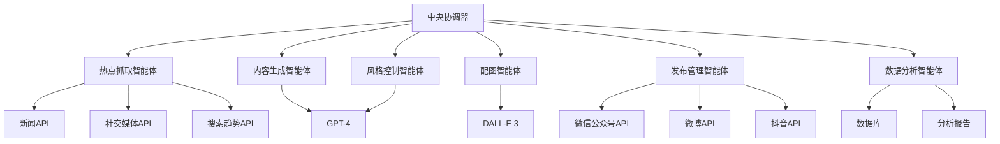
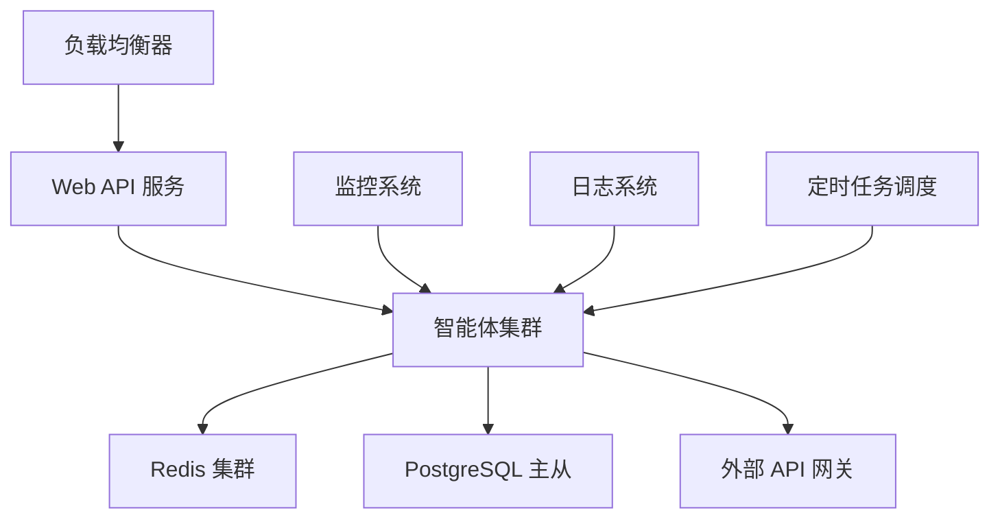

# 新媒体运营 AI 系统设计文档

## 系统架构概览

本系统采用多智能体协作架构，基于 Microsoft Agent Framework 构建，包含六个核心智能体和一个中央协调器。



## 核心组件设计

### 1. 中央协调器 (Central Orchestrator)

**职责:** 协调各智能体间的工作流程，管理任务队列和状态

**技术实现:**
- 使用 `WorkflowBuilder` 构建智能体工作流
- 实现任务调度和状态管理
- 提供统一的 API 接口

```python
class CentralOrchestrator:
    def __init__(self):
        self.workflow = self._build_workflow()
        self.task_queue = asyncio.Queue()
        self.status_manager = StatusManager()
    
    def _build_workflow(self):
        return (WorkflowBuilder()
            .set_start_executor(self.hotspot_agent)
            .add_edge(self.hotspot_agent, self.content_agent)
            .add_edge(self.content_agent, self.style_agent)
            .add_edge(self.style_agent, self.image_agent)
            .add_edge(self.image_agent, self.publish_agent)
            .add_edge(self.publish_agent, self.analytics_agent)
            .build())
```

### 2. 热点抓取智能体 (Hotspot Crawler Agent)

**职责:** 自动获取和分析热点信息

**数据源:**
- 微博热搜 API
- 百度搜索指数 API
- 今日头条 API
- Google Trends API
- Reddit API

**核心功能:**
- 多源数据聚合
- 热度计算算法
- 内容去重和质量评估
- 趋势预测

```python
@ai_function(description="获取当前热点信息并计算热度指数")
async def get_trending_topics(
    sources: List[str] = ["weibo", "baidu", "toutiao"],
    time_range: str = "1h"
) -> List[TrendingTopic]:
    """获取多平台热点信息"""
    pass

class HotspotCrawlerAgent(ChatAgent):
    def __init__(self):
        super().__init__(
            chat_client=OpenAIChatClient(),
            instructions="""
            你是一个专业的热点信息分析师。你的任务是：
            1. 从多个数据源获取最新热点信息
            2. 分析热点的传播趋势和影响力
            3. 评估热点的商业价值和适用性
            4. 提供热点相关的关键词和标签
            """,
            tools=[get_trending_topics, calculate_hotness_score]
        )
```

### 3. 内容生成智能体 (Content Generation Agent)

**职责:** 根据热点信息生成适合不同平台的内容

**平台适配:**
- 微信公众号: 长文章 (1000-3000字)
- 微博: 短文 (140字以内)
- 抖音/快手: 短视频脚本 (15-60秒)
- 小红书: 图文笔记 (200-500字)

```python
class ContentGenerationAgent(ChatAgent):
    def __init__(self):
        super().__init__(
            chat_client=OpenAIChatClient(),
            instructions="""
            你是一个专业的新媒体内容创作专家。根据热点信息和目标平台特性，
            生成高质量、有吸引力的内容。需要考虑：
            1. 平台用户特征和偏好
            2. 内容格式和长度限制
            3. SEO 优化和传播效果
            4. 品牌调性和价值观
            """,
            tools=[generate_wechat_article, generate_weibo_post, 
                  generate_video_script, generate_xiaohongshu_note]
        )

@ai_function(description="为微信公众号生成长文章")
async def generate_wechat_article(
    topic: str,
    keywords: List[str],
    target_length: int = 2000,
    style: str = "professional"
) -> WeChatArticle:
    """生成微信公众号文章"""
    pass
```

### 4. 风格控制智能体 (Style Control Agent)

**职责:** 确保内容符合品牌调性和目标受众偏好

**风格参数:**
- 语言风格: 正式/轻松/幽默/专业
- 目标受众: 年龄段、兴趣偏好、教育水平
- 品牌调性: 权威/亲和/创新/传统
- 情感倾向: 积极/中性/批判

```python
class StyleControlAgent(ChatAgent):
    def __init__(self):
        super().__init__(
            chat_client=OpenAIChatClient(),
            instructions="""
            你是一个品牌内容风格顾问。你需要：
            1. 分析现有内容的风格特征
            2. 根据品牌指南调整内容调性
            3. 确保内容符合目标受众偏好
            4. 过滤敏感或不当内容
            """,
            tools=[analyze_content_style, adjust_tone, 
                  filter_sensitive_content, optimize_for_audience]
        )
```

### 5. 配图智能体 (Image Generation Agent)

**职责:** 生成或推荐合适的视觉内容

**功能模块:**
- AI 图片生成 (DALL-E 3)
- 图库搜索和推荐
- 图片风格调整
- 视频封面设计

```python
class ImageGenerationAgent(ChatAgent):
    def __init__(self):
        super().__init__(
            chat_client=OpenAIChatClient(),
            instructions="""
            你是一个专业的视觉设计师。根据文字内容：
            1. 分析内容主题和情感色彩
            2. 设计合适的视觉元素
            3. 生成图片描述和关键词
            4. 确保视觉风格与品牌一致
            """,
            tools=[HostedCodeInterpreterTool(), generate_image_prompt,
                  search_stock_images, create_video_thumbnail]
        )

@ai_function(description="生成 AI 图片的提示词")
async def generate_image_prompt(
    content_summary: str,
    style: str = "modern",
    color_scheme: str = "vibrant"
) -> str:
    """根据内容生成图片提示词"""
    pass
```

### 6. 发布管理智能体 (Publishing Agent)

**职责:** 管理多平台内容发布和调度

**支持平台:**
- 微信公众号
- 微博
- 抖音/快手
- 小红书
- B站

```python
class PublishingAgent(ChatAgent):
    def __init__(self):
        super().__init__(
            chat_client=OpenAIChatClient(),
            instructions="""
            你是一个专业的新媒体运营管理员。负责：
            1. 根据平台特性格式化内容
            2. 安排最佳发布时间
            3. 管理发布队列和状态
            4. 处理发布异常和重试
            """,
            tools=[format_for_platform, schedule_post,
                  publish_to_wechat, publish_to_weibo]
        )
```

### 7. 数据分析智能体 (Analytics Agent)

**职责:** 收集和分析内容表现数据

**分析维度:**
- 阅读量/播放量
- 点赞/评论/转发
- 用户画像分析
- 传播路径追踪

```python
class AnalyticsAgent(ChatAgent):
    def __init__(self):
        super().__init__(
            chat_client=OpenAIChatClient(),
            instructions="""
            你是一个专业的数据分析师。你需要：
            1. 收集各平台的内容表现数据
            2. 分析用户互动和反馈
            3. 识别成功内容的特征
            4. 提供优化建议和趋势预测
            """,
            tools=[collect_platform_data, analyze_engagement,
                  generate_report, predict_trends]
        )
```

## 数据模型设计

### 热点信息模型
```python
@dataclass
class TrendingTopic:
    id: str
    title: str
    description: str
    keywords: List[str]
    hotness_score: float
    source: str
    timestamp: datetime
    category: str
    sentiment: str
```

### 内容模型
```python
@dataclass
class GeneratedContent:
    id: str
    topic_id: str
    platform: str
    title: str
    content: str
    tags: List[str]
    images: List[str]
    style_params: Dict[str, Any]
    created_at: datetime
    status: str
```

### 发布记录模型
```python
@dataclass
class PublishRecord:
    id: str
    content_id: str
    platform: str
    published_at: datetime
    post_url: str
    metrics: Dict[str, int]
    status: str
```

## 工作流程设计

### 主要工作流
1. **热点发现流程**: 定时抓取 → 热度计算 → 质量评估 → 触发生成
2. **内容生成流程**: 主题分析 → 平台适配 → 风格调整 → 配图生成
3. **发布管理流程**: 格式检查 → 时间调度 → 批量发布 → 状态监控
4. **数据分析流程**: 数据收集 → 指标计算 → 趋势分析 → 报告生成

### 异常处理
- API 调用失败重试机制
- 内容质量不达标自动重新生成
- 发布失败自动回滚和通知
- 数据异常检测和预警

## 技术栈

**核心框架:**
- Microsoft Agent Framework (Python)
- OpenAI GPT-4 / Azure OpenAI
- FastAPI (Web API)
- SQLAlchemy (数据库 ORM)

**外部服务:**
- Redis (缓存和队列)
- PostgreSQL (数据存储)
- Celery (异步任务)
- Docker (容器化部署)

**监控和日志:**
- Prometheus + Grafana (监控)
- ELK Stack (日志分析)
- Sentry (错误追踪)

## 部署架构



## 安全设计

1. **API 安全**: OAuth 2.0 认证，API 密钥管理
2. **数据安全**: 敏感信息加密，访问权限控制
3. **内容安全**: 敏感词过滤，内容审核机制
4. **系统安全**: 容器隔离，网络安全策略