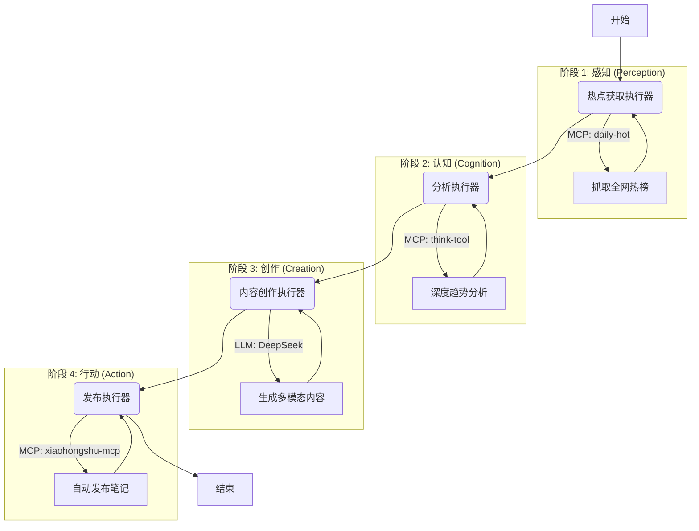

# HotFlow AI - 智能社交媒体内容生产系统

<div align="center">


**基于 Agent Framework 的企业级智能体工作流系统，实现社交媒体内容的全自动生产。**
*由 Microsoft Agent Framework, Model Context Protocol (MCP) 以及 DeepSeek 大模型驱动。*

[项目概述](#项目概述) • [系统架构](#系统架构) • [核心特性](#核心特性与创新) • [快速开始](#快速开始) • [文档](#文档)

</div>

---

## 项目概述

**HotFlow AI** 是一个先进的内容生成系统，旨在实现社交媒体运营全生命周期的自动化。通过利用 **Microsoft Agent Framework** 和 **Model Context Protocol (MCP)**，它编排了一组专业的 AI 智能体，协同完成实时热点追踪、深度认知分析以及多平台内容生成的任务。

与简单的脚本工具不同，HotFlow AI 实现了模拟人类认知过程的 **顺序智能体工作流 (Sequential Agentic Workflow)**：
1.  **感知 (Perception)**：实时监控 B站、微博、知乎等 15+ 个平台的热榜数据。
2.  **认知 (Cognition)**：利用"慢思考"模型对热点进行深度分析，识别具有爆款潜力的趋势。
3.  **创作 (Creation)**：生成适配特定平台风格的内容（文案、标签、配图建议）。
4.  **行动 (Action)**：自动发布内容到小红书等社交平台。

## 核心特性与创新

### 🔌 原生 MCP 集成 (Native MCP Integration)
基于 **Model Context Protocol (MCP)** 从零构建，实现了与外部工具和数据源的标准化无缝连接。
- **数据源**：集成 `daily-hot-mcp` 实现全网热点实时聚合。
- **发布能力**：集成 `xiaohongshu-mcp` 实现自动化发帖。
- **高扩展性**：只需接入标准的 MCP Server，即可轻松扩展新工具或新平台。

### 🤖 Agent Framework 架构
利用微软强大的 **Agent Framework** 来管理复杂的工作流。
- **顺序执行流**：构建结构化的流水线，每个智能体将上下文精准传递给下一个环节。
- **专业化执行器**：模块化设计，拥有热点获取、深度分析、内容创作、自动发布等专用 Executor。
- **DevUI 可视化**：提供实时的可视化界面，用于调试智能体交互和监控状态变化。

### 🧠 深度认知分析 (Deep Cognitive Analysis)
不仅仅是简单的总结，系统引入了 **"思考 (Thinking)" 步骤**。
- 使用 `think-tool` 对热点数据进行多步推理。
- 在开始写作前，先对话题进行分类、跨平台趋势识别和内容策略制定，确保输出质量。

### ⚡ 高性能与低成本
- **DeepSeek LLM**：针对 DeepSeek API 进行了深度优化，以极低的成本提供媲美 GPT-4 的性能。
- **智能缓存**：高效的数据处理机制，最小化 API 调用次数并降低延迟。

## 系统架构

系统运行在一个 4 阶段的顺序流水线上：



## 快速开始

### 前置要求
- Python 3.10 或更高版本
- DeepSeek API Key (可在 [platform.deepseek.com](https://platform.deepseek.com) 获取)
- (可选) 小红书账号，用于自动发布功能

### 安装步骤

1.  **克隆仓库**
    ```bash
    git clone https://github.com/shiro123444/social-media-ai-system.git
    cd social-media-ai-system
    ```

2.  **安装依赖**
    ```bash
    pip install -r requirements.txt
    ```

3.  **配置环境**
    复制 `.env.example` 为 `.env` 并配置你的密钥：
    ```bash
    cp .env.example .env
    ```
    编辑 `.env` 文件：
    ```env
    DEEPSEEK_API_KEY=sk-your-api-key
    DEEPSEEK_BASE_URL=https://api.deepseek.com
    
    # 可选: 小红书配置
    XIAOHONGSHU_MCP_URL=http://localhost:18060/mcp
    XHS_DEFAULT_IMAGES=C:\Path\To\Default\Image.jpg
    ```

### 运行系统

1.  **启动 MCP 服务** (如果是本地运行)
    ```bash
    # 终端 1: 启动 Daily Hot MCP (热点源)
    cd daily-hot-mcp
    python -m daily_hot_mcp
    ```
    *(注意: 如需发布到小红书，请确保 `xiaohongshu-mcp` 也在运行中)*

2.  **启动工作流**
    ```bash
    # 终端 2: 启动 DevUI 可视化界面
    python start_devui.ps1
    ```

3.  **开始交互**
    打开浏览器访问 `http://localhost:9000`。
    选择 **"social_media_workflow"** 并输入指令，例如：
    > "获取今天的科技热点并发布一篇小红书笔记"

## 项目结构

```
social-media-ai-system/
├── agents/
│   └── social_media_workflow/      # 核心工作流逻辑
│       └── __init__.py             # Executor 具体实现
├── config/                         # 配置文件与预设
├── daily-hot-mcp/                  # 热点数据源 MCP Server
├── docs/                           # 项目文档
├── templates/                      # 内容模板
├── utils/                          # 辅助工具类
├── start_devui.ps1                 # 启动脚本
└── requirements.txt                # 项目依赖
```

## 技术架构详解

### 核心组件交互
系统采用分层架构设计，确保了组件的解耦与高内聚：

1.  **编排层 (Orchestration Layer)**: 基于 `Microsoft Agent Framework` 的 `SequentialBuilder`，负责管理 `WorkflowContext` 和消息流转。
2.  **执行层 (Execution Layer)**: 自定义的 `Executor` 类（如 `MCPHotspotExecutor`），实现了业务逻辑与工具调用的封装。
3.  **工具层 (Tool Layer)**: 通过 **MCP (Model Context Protocol)** 标准化接入外部能力。
    - **HTTP MCP**: 用于网络服务（如 `daily-hot-mcp`, `xiaohongshu-mcp`），支持远程部署与调用。
    - **Stdio MCP**: 用于本地计算密集型任务（如 `think-tool`），通过标准输入输出直接交互，零网络延迟。

### 动态工具生命周期管理
为了解决 Agent Framework 在同步环境加载模块与 MCP 异步连接之间的矛盾，我们设计了**动态生命周期管理模式**：

```python
# 伪代码示例：在 Executor 中动态管理 MCP 连接
@handler
async def execute(self, ...):
    # 1. 在异步 handler 内部建立连接
    async with MCPStreamableHTTPTool(url=...) as tool:
        # 2. 动态创建绑定了该工具的临时 Agent
        agent = client.create_agent(..., tools=[tool])
        # 3. 执行任务
        result = await agent.run(query)
    # 4. 自动断开连接，释放资源
```

这种模式确保了每个请求都有独立的工具实例，避免了长连接导致的稳定性问题，同时完美适配了 DevUI 的热重载机制。

## 工程挑战与解决方案

在构建企业级 Agent 系统过程中，我们攻克了以下关键技术难题：

### 1. 多模态消息协议适配 (DeepSeek Adapter)
*   **挑战**: Agent Framework 原生采用 OpenAI 的多模态消息格式，而 DeepSeek API 仅支持纯文本输入，导致直接调用报错。
*   **方案**: 开发了 `DeepSeekChatClient` 适配器，在底层拦截并重写消息解析逻辑，将多模态对象（如 `ImageContent`）降级或转换为纯文本描述，实现了对 DeepSeek 模型的完美兼容。

### 2. DevUI 序列化异常修复
*   **挑战**: 框架内部的 `TextContent` 对象在通过 DevUI 进行 WebSocket 传输时，因缺少序列化方法导致 `object.__setattr__` 错误。
*   **方案**: 实现了 `TextOnlyConversation` 中间件，在消息传递给 DevUI 前进行"清洗"，提取纯文本内容并重新封装，确保了可视化界面的稳定运行。

### 3. 认知增强 (Cognitive Enhancement)
*   **挑战**: 传统 LLM 在处理复杂热点分析时容易产生幻觉或浅层分析。
*   **方案**: 引入 `think-tool` 作为"系统 2"思维插件。强制模型在生成内容前先输出 `<thinking>` 过程，进行分类、归纳和演绎推理，显著提升了最终内容的逻辑性和深度。

## 团队成员

| 姓名 | 角色 | 院校 |
|------|------|-------------|
| **范延哲** | 队长 (Team Lead) | 武汉商学院 |
| **何旭** | 成员 (Member) | 武汉商学院 |
| **郑显龙** | 成员 (Member) | 武汉商学院 |

## 开源协议

本项目采用 MIT 协议开源。详情请参阅 [LICENSE](LICENSE) 文件。

---
<div align="center">
Developed by the <b>武汉商学院 智汇AI协会</b> 🎓
</div>
